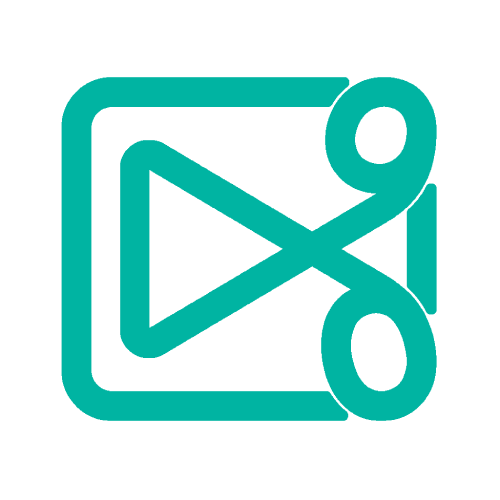

<p align="center">
  
</p>

<h1 align="center">WebCut</h1>
<p align="center">
  <a href="https://www.npmjs.com/package/webcut">
    
  </a>
  <a href="https://github.com/yourusername/webcut/blob/main/LICENSE">
    
  </a>
  <a href="https://github.com/yourusername/webcut">
    
  </a>
</p>

<p align="center">一个强大的 Web 视频编辑 UI 框架，助力 Web 应用快速集成专业级视频编辑能力。</p>

## 📋 目录

- [项目简介](#项目简介)
- [设计理念](#设计理念)
- [核心功能](#核心功能)
- [快速示例](#快速示例)
- [安装](#安装)
- [文档](#文档)
- [许可证](#许可证)
- [致谢](#致谢)

## 项目简介

WebCut 是一款专为 Web 应用开发的视频编辑 UI 框架。它通过直观的画布界面与完善的时间线工具，让开发者可以在浏览器中轻松完成视频剪辑、文本/图形叠加、元素布局与变换等操作，并以模块化方式集成到自己的应用中。

<p align="center">
  🚀 快速集成 · 🎨 丰富功能 · 📱 响应式设计 · ⚡ 高性能体验
</p>

## 设计理念

WebCut 的核心理念是「复杂能力，简单使用」。我们相信在 Web 平台实现专业级视频编辑不应成为负担。通过组件化架构与响应式 API，开发者可以专注于创意本身，而不是底层细节。

### 我们的设计原则

| 原则 | 描述 |
|------|------|
| 🎯 **易用性优先** | 直观接口与清晰文档，降低学习成本 |
| ⚡ **性能优化** | 针对浏览器环境优化，确保流畅运行 |
| 🔧 **可扩展性** | 模块化设计，便于定制和功能扩展 |
| 🛡️ **类型安全** | 完备的 TypeScript 支持，减少开发错误

## 核心功能

### 编辑与创作

| 功能 | 描述 |
|------|------|
| 🎨 **画布编辑** | 基于 Canvas 的直观编辑界面，所见即所得 |
| 🎬 **播放器控制** | 播放/暂停、进度与音量控制，支持帧级精确操作 |
| 📝 **文本叠加** | 多样式文本添加与自定义，支持富文本效果 |
| ⏱️ **时间线** | 精确的时间线控制，支持缩放、定位与片段管理 |
| 🎛️ **元素变换** | 直观的缩放、旋转与位置调节，支持精确数值输入 |

### 辅助工具

| 功能 | 描述 |
|------|------|
| 📏 **尺寸测量** | 精确的文本、视频与图像尺寸计算与控制 |
| 🧰 **工具函数** | 导出 Blob、文本转图像等实用功能 |
| 📱 **响应式设计** | 适配不同屏幕尺寸，提供一致的编辑体验 |

### 项目展示

> *这里可以放置项目截图或演示视频*

## 快速示例

### 在 Vue 项目中集成

以下示例展示如何在 Vue 项目中快速集成 WebCut：

```vue
<script setup lang="ts">
// 导入核心组件和样式
import { WebCutEditor } from 'webcut';
import 'webcut/esm/style.css';

// 项目ID（示例）
const yourProjectId = 'example-project';
</script>

<template>
  <div class="editor-container">
    <h1>视频编辑器</h1>
    <!-- 直接使用完整编辑器组件 -->
    <WebCutEditor :project-id="yourProjectId" />
  </div>
</template>

<style scoped>
.editor-container {
  width: 100%;
  height: 100vh;
  display: flex;
  flex-direction: column;
}
</style>
```

> **提示**：上述代码将渲染一个完整的视频编辑界面，包括视频画布、工具栏与时间线。你也可以按需从 `webcut` 引入组件与工具进行定制。

## 安装

WebCut 支持多种包管理器安装方式：

```bash
# 使用 npm
npm install webcut

# 使用 yarn
yarn add webcut

# 使用 pnpm
pnpm add webcut
```

> **注意**：WebCut 目前支持现代浏览器环境，在使用前请确保您的项目已配置好必要的 polyfill（如需支持旧浏览器）。

## 文档

WebCut 提供了详细的文档支持，帮助你快速上手：

- **API 文档**：位于 `docs/api.md` 和 `docs/zh-cn/api.md`
- **组件文档**：详细的组件使用说明
- **快速入门指南**：帮助新用户快速上手
- **常见问题**：解决方案与最佳实践

> 如需在线查看文档，请访问我们的文档站点。

## 许可证

本项目采用 **MIT 许可证**，允许自由使用、修改和分发。详见 <mcfile name="LICENSE" path="/Users/frustigor/dev/webcut/LICENSE"></mcfile> 文件。

## 致谢

WebCut 的开发离不开以下优秀开源项目的支持：

### 核心依赖

- [@webav/av-canvas](https://github.com/bilibili/webav/tree/main/packages/av-canvas) - 提供底层视频渲染能力
- [@webav/av-cliper](https://github.com/bilibili/webav/tree/main/packages/av-cliper) - 视频剪辑功能支持
- [Vue 3](https://vuejs.org/) - 响应式前端框架

### 开发工具

- [TypeScript](https://www.typescriptlang.org/) - 类型系统支持
- [naive-ui](https://www.naiveui.com/) - UI组件库
- [@vicons](https://vicons.mono.company/) - 图标库

感谢这些项目的贡献者为开源社区做出的努力！

---

> **提示**：如果你喜欢这个项目，请给我们一个 ⭐️ 支持！